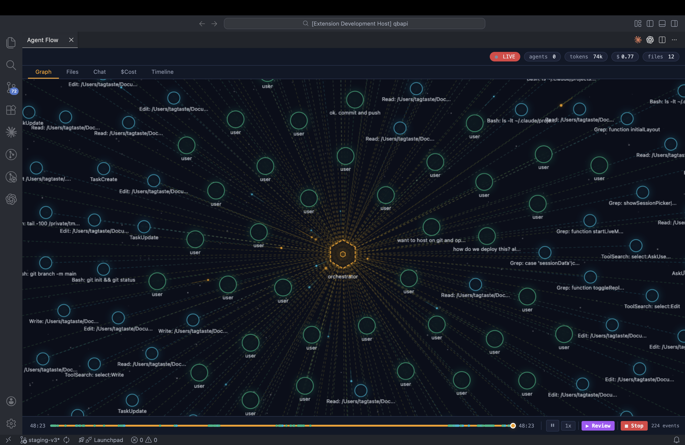
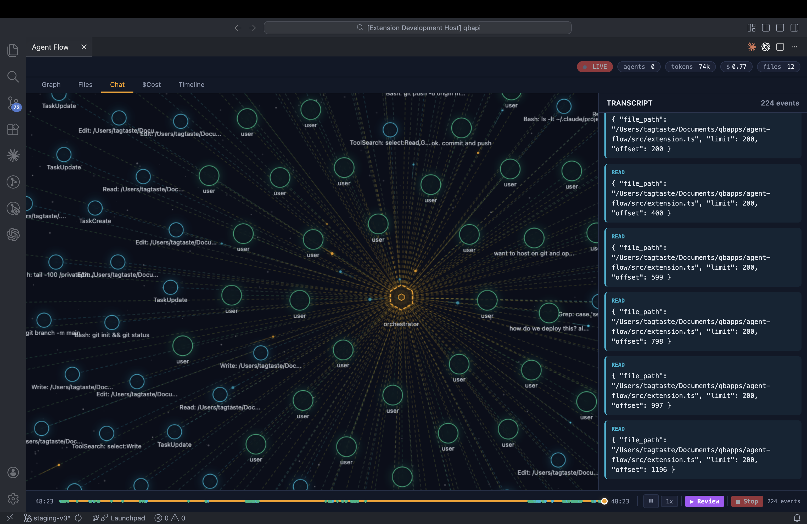
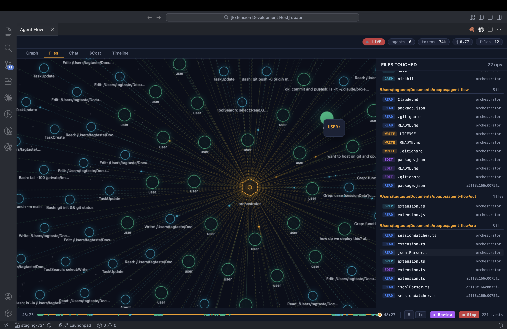

# Agent Flow

Real-time visualization of Claude Code multi-agent workflows as an interactive, force-directed graph inside VS Code.


### Graph View — Live Mode


### Chat Transcript


### Files Touched


> A video demo is available at [`assets/agent-flow-demo.mp4`](assets/agent-flow-demo.mp4).

## Features

- **Live Mode** — Watch agents work in real-time with automatic file polling
- **Force-Directed Graph** — Interactive physics-based layout with zoom, pan, and node dragging
- **Session Replay** — Step through completed sessions with scrubber, speed controls (0.25x–8x), and entrance animations
- **Token & Cost Tracking** — Cumulative token usage and estimated cost per session
- **Files View** — See which files each agent read, wrote, edited, or searched
- **Chat Transcript** — Full conversation with role labels and monospace formatting
- **Timeline** — Chronological event list with relative timestamps and agent attribution
- **Cost Breakdown** — Tool usage frequency bar chart and per-agent breakdown
- **Dark Space Theme** — Starfield background, hexagonal agent nodes, particle effects, glow rendering

## How It Works

Claude Code stores every session as JSONL files at `~/.claude/projects/`. This extension:

1. **Parses** JSONL transcripts to extract user messages, assistant responses, tool calls, and sub-agent spawns
2. **Builds a graph** with nodes (orchestrator, agents, tools, user messages) and edges
3. **Renders** the graph on an HTML5 Canvas with force-directed physics
4. **Polls** files for changes (stat-based, every 400ms) to provide live updates without resetting the view

## Installation

### Download Release (Recommended)

1. Go to [Releases](https://github.com/maplenk/claude-agent-flow/releases/latest)
2. Download `agent-flow-0.1.0.vsix`
3. Install:
```bash
code --install-extension agent-flow-0.1.0.vsix
```

### From Source

```bash
git clone https://github.com/maplenk/claude-agent-flow.git
cd claude-agent-flow
npm install
npm run compile
```

Press **F5** in VS Code to launch the Extension Development Host.

### Usage

1. **Cmd+Shift+P** (or Ctrl+Shift+P) → "Agent Flow: Open Visualization"
2. Click **Auto-Detect Active Session** or **Browse Sessions**
3. Live mode starts automatically — click **Stop** in the timeline bar to pause

## Architecture

```
src/
├── extension.ts        # Extension host + inline webview (CSS/HTML/JS as template literals)
├── jsonlParser.ts      # Parses JSONL transcripts → graph nodes, edges, file touches, cost
└── sessionWatcher.ts   # Stat-based file poller for live mode (not fs.watch — unreliable on macOS)
```

| Component | Role |
|-----------|------|
| `jsonlParser` | Reads JSONL files, extracts nodes (orchestrator, user, assistant, agent, tool), edges, file touches, and token costs |
| `SessionWatcher` | Polls files via `fs.stat()` every 400ms, reads incremental bytes, emits change events |
| Webview | Canvas 2D rendering at 60fps — force-directed layout, particle system, star field, replay engine |

Zero runtime dependencies. Only `@types/vscode`, `@types/node`, and `typescript` as dev deps.

## Data Source

```
~/.claude/projects/
├── -path-to-project/
│   ├── <session-id>.jsonl            # Main session transcript
│   └── <session-id>/subagents/
│       └── agent-<id>.jsonl          # Sub-agent transcripts
```

## Contributing

Contributions welcome. Please open an issue first to discuss what you'd like to change.

## License

[MIT](LICENSE)
